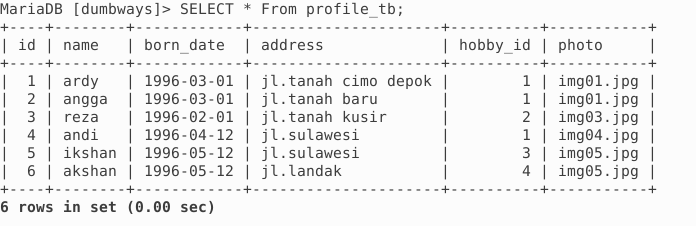
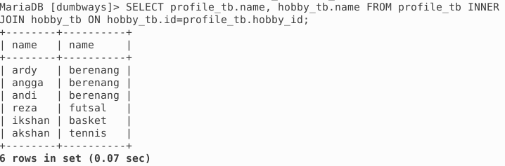

# dumbwayskloter1

 disini saya menggunakan bahasa Pemrograman php 
 

# software yang dibutuhkan:
<ul>
  <li> Text Editor (Visual studio code) </li>
  <li> Database(mariadb) </li>
  <li> Web Browser (Google Crome) </li>
</ul>

# Cara Menjalankan aplikasi:
<ul>
  <li>Buat folder nama_folder pada C/xammp/htdoc</li>
  <li>Kemudian clone data pada link github </li>
  <li>buka web browser(Google Crome / Mozilla Firefox) </li>
  <li>lalu klik localhost/nama_folder</li>
</ul>

# screenshot

 Tampilkan seluruh data dari table profile 

 Tampilkan seluruh data profil beserta hobi yang diminati 

 Tampilkan seluruh data profil yang memiliki hobi tertentu 

# install no 4
